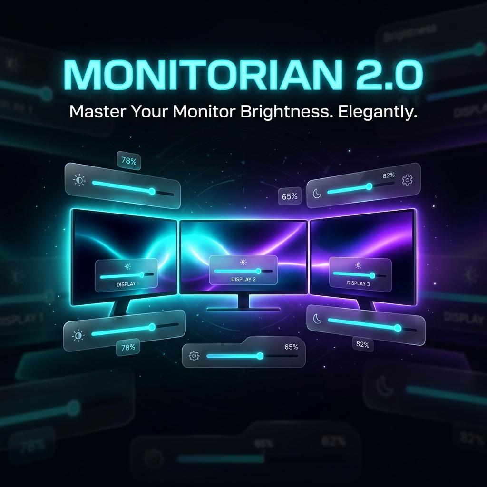

# Monitorian 2.0



[](https://github.com/kshitij-garg/Monitorian-2.0/releases/latest)
[](#)
[](LICENSE.txt)
[](#)

**Monitorian 2.0** is an open-source Windows desktop utility to adjust the brightness and contrast of multiple monitors with ease. Developed as an enhanced continuation and independent fork of Monitorian, version 2.0 introduces community-requested quality-of-life improvements with absolute zero friction: a free native CLI engine, tray scroll OSD, automatic brightness restore on wake, and true single-file portable execution.

---

## Direct Downloads

No installer or administrator privileges required. Download and run directly:

| Binary | Description | Direct Link |
| :--- | :--- | :--- |
| **`Monitorian.exe`** | **True Single-File Standalone Executable**<br>Self-contained with all dependencies bundled via Costura.Fody. | [Download `Monitorian.exe`](https://github.com/kshitij-garg/Monitorian-2.0/releases/latest/download/Monitorian.exe) |
| **`Monitorian-Portable.exe`** | **Zero-Config Portable Executable**<br>Automatically keeps all configuration files in its local folder without writing to `%LocalAppData%`. | [Download `Monitorian-Portable.exe`](https://github.com/kshitij-garg/Monitorian-2.0/releases/latest/download/Monitorian-Portable.exe) |
| **`Monitorian-2.2.0.zip`** | **Complete Release Archive**<br>Includes standalone executables, configurations, and all 20+ localization satellite language packs. | [Download `Monitorian-2.2.0.zip`](https://github.com/kshitij-garg/Monitorian-2.0/releases/latest/download/Monitorian-2.2.0.zip) |

---

## What's New in Monitorian 2.0

```
┌────────────────────────────────────────────────────────────────────────┐
│                          MONITORIAN 2.0                                │
│                                                                        │
│   [Free CLI Engine]        [Tray Scroll OSD]       [Restore on Wake]   │
│   Native /get & /set       Hover & wheel adjust    Auto-reapply level  │
│                                                                        │
│   [Single-File Executable] [Zero-Config Portable]  [Exposed Settings]  │
│   No external DLLs needed  Zero AppData footprint  Direct UI controls  │
└────────────────────────────────────────────────────────────────────────┘
```

### Key Highlights

| Feature | Details |
| :--- | :--- |
| ⚡ **Free Native CLI Engine** | Unlocks free command-line brightness and contrast automation directly in the app. No paid store add-ons or subscriptions required. |
| 🎛️ **Tray Icon Scroll OSD** | Hover over the notification area icon and scroll your mouse wheel to adjust brightness. Features a Windows 11-style auto-theming On-Screen Display. |
| 🔄 **Restore Brightness on Wake** | Resolves the common DDC/CI issue where external monitors reset to 100% or hardware defaults after waking from sleep, hibernation, or display timeout. |
| 🧳 **True Single-File Portable Mode** | All WPF dependencies (`StartupAgency`, `ScreenFrame`, `Microsoft.Xaml.Behaviors`) are embedded directly into the binary. Zero installation friction. |
| ⚙️ **Exposed UI Settings** | Frequently used power-user settings are now exposed directly as toggles in the GUI settings menu. |
| ✨ **Frictionless Defaults** | Scroll OSD and Wake Restoration are active by default so everything works immediately upon first launch. |

---

## Command-Line Interface (CLI) Quick Reference

Monitorian 2.0 provides native command-line control for scripting, batch operations, Task Scheduler, and third-party launchers (e.g. Stream Deck, AutoHotkey).

### Common Commands

```powershell
# Get brightness of all connected monitors
Monitorian.exe /get

# Set brightness of all monitors to 50%
Monitorian.exe /set 50

# Set brightness of a specific monitor by name or device ID
Monitorian.exe /set "Dell U2720Q" 75

# Relative adjustments (increase or decrease by percentage)
Monitorian.exe /set +10
Monitorian.exe /set -15

# Get or adjust contrast
Monitorian.exe /get contrast
Monitorian.exe /set contrast 60
Monitorian.exe /set contrast "LG UltraGear" 55
```

### CLI Command Summary

| Action | Command Syntax |
| :--- | :--- |
| **Get All Brightness** | `Monitorian.exe /get` |
| **Get Single Monitor Brightness** | `Monitorian.exe /get "Monitor Name"` or `Monitorian.exe /get [DeviceID]` |
| **Set Global Brightness** | `Monitorian.exe /set [0-100]` |
| **Set Single Monitor Brightness** | `Monitorian.exe /set "Monitor Name" [0-100]` |
| **Relative Brightness Adjustment** | `Monitorian.exe /set +[Value]` or `Monitorian.exe /set -[Value]` |
| **Get Contrast** | `Monitorian.exe /get contrast` |
| **Set Contrast** | `Monitorian.exe /set contrast [0-100]` |

---

## Portable Mode Execution

Monitorian 2.0 provides two convenient ways to run portably without leaving data in your user profile:

1. **Automatic Detection:** Simply run `Monitorian-Portable.exe`. It automatically detects its executable name and stores all settings in its local directory.
2. **Marker File:** Place an empty file named `portable.ini` alongside `Monitorian.exe` to redirect configuration storage to the application folder.

> [!NOTE]
> If the application directory is read-only (such as `C:\Program Files\`), Monitorian 2.0 automatically falls back to `%LocalAppData%\Monitorian` to ensure your settings are never lost.

---

## System Requirements

- **Operating System:** Windows 10 (version 1607 or newer) or Windows 11
- **Runtime:** .NET Framework 4.8 (pre-installed on modern Windows versions)
- **Display Hardware:** External monitors must support and enable **DDC/CI** in their hardware on-screen menu.

---

## Building from Source

You can build Monitorian 2.0 locally using Visual Studio 2022 or the standalone MSBuild Build Tools:

```powershell
# 1. Clone the repository
git clone https://github.com/kshitij-garg/Monitorian-2.0.git
cd Monitorian-2.0

# 2. Restore NuGet dependencies
msbuild Source/Monitorian.sln /t:Restore /p:Configuration=Release

# 3. Compile Release binaries
msbuild Source/Monitorian.sln /p:Configuration=Release
```

The output executables (`Monitorian.exe` and `Monitorian-Portable.exe`) will be generated in `Source/Monitorian/bin/Release/`.

---

## Community & Localization

Monitorian 2.0 includes localization translations provided by community contributors:

- **Arabic (ar)**: [@MohammadShughri](https://github.com/mohammadshughri)
- **Catalan (ca)**: [@ericmp33](https://github.com/ericmp33)
- **German (de)**: [@uDEV2019](https://github.com/uDEV2019)
- **Greek (el-GR)**: [@NickMihal](https://github.com/NickMihal)
- **Spanish (es)**: [@josemirm](https://github.com/josemirm), [@ericmp33](https://github.com/ericmp33)
- **Persian (fa-IR)**: [@sinadalvand](https://github.com/sinadalvand)
- **French (fr)**: [@AlexZeGamer](https://github.com/AlexZeGamer), [@Rikiiiiiii](https://github.com/rikiiiiiii)
- **Italian (it)**: [@GhostyJade](https://github.com/GhostyJade)
- **Japanese (ja-JP)**: [@emoacht](https://github.com/emoacht)
- **Korean (ko-KR)**: [@VenusGirl](https://github.com/VenusGirl)
- **Dutch (nl-NL)**: [@JordyEGNL](https://github.com/JordyEGNL)
- **Polish (pl-PL)**: [@Daxxxis](https://github.com/Daxxxis), [@FakeMichau](https://github.com/FakeMichau)
- **Portuguese (pt-BR)**: [@guilhermgonzaga](https://github.com/guilhermgonzaga)
- **Romanian (ro)**: [@calini](https://github.com/calini)
- **Russian (ru-RU)**: [@SigmaTel71](https://github.com/SigmaTel71), [@San4es](https://github.com/San4es)
- **Slovenian (sl)**: [@anderlli0053](https://github.com/anderlli0053)
- **Albanian (sq)**: @RDN000
- **Swedish (sv-SE)**: [@Sopor](https://github.com/Sopor)
- **Turkish (tr-TR)**: [@webbudesign](https://github.com/webbudesign)
- **Ukrainian (uk-UA)**: [@kaplun07](https://github.com/kaplun07)
- **Vietnamese (vi-VN)**: [@dongsinhho](https://github.com/dongsinhho)
- **Simplified Chinese (zh-Hans)**: [@ComMouse](https://github.com/ComMouse), [@zhujunsan](https://github.com/zhujunsan), [@XMuli](https://github.com/XMuli), [@FISHandCHEAP](https://github.com/Fishandcheap), [@FrzMtrsprt](https://github.com/FrzMtrsprt)
- **Traditional Chinese (zh-Hant)**: [@toto6038](https://github.com/toto6038), [@XMuli](https://github.com/XMuli)

---

## Credits & License

- **Foundational Architecture:** Created by [emoacht](https://github.com/emoacht).
- **Monitorian 2.0 Continuation:** Maintained by [kshitij-garg](https://github.com/kshitij-garg).
- **License:** Distributed under the [MIT License](LICENSE.txt).
